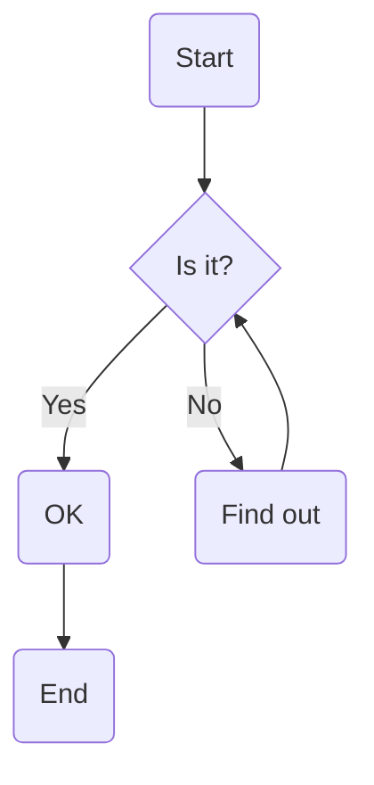

# Mermaid Edit & Export

A powerful, feature-rich web-based Mermaid.js diagram editor with AI-powered generation, advanced theming, and professional export capabilities.


## Features

### AI-Powered Diagram Generation
- Generate Mermaid diagrams from plain text descriptions using **Google Gemini AI**
- Intelligent node and edge creation with automated layout
- Customizable icon mappings for enhanced visualizations
- Support for Google Cloud, cloud computing, and general service icons

### Advanced Theme System
Choose from 20+ professionally designed themes:
- **Tech Giants**: Google Cloud, Microsoft Azure, Amazon AWS, NVIDIA
- **AI Companies**: OpenAI, Claude (Anthropic)
- **Enterprise**: Meta, Apple, Netflix, Oracle, IBM
- **Consulting**: TCS, Accenture, Infosys, Wipro, EXL
- **Classic Themes**: Dark, Forest, Ocean, Sunset
- **Custom Theme Builder**: Create your own color schemes

### Comprehensive Styling Options

#### Typography
- **50+ Font Families** including:
  - Sans-serif: Roboto, Open Sans, Lato, Montserrat, Poppins, Inter, and more
  - Serif: Merriweather, Playfair Display, Lora, EB Garamond, and more
  - Monospace: JetBrains Mono, Fira Code, Source Code Pro, and more
  - Display: Oswald, Bebas Neue, Pacifico, and more
- Adjustable font size (10-32px)
- Font weight control (Normal, Bold, Bolder)

#### Node Customization
- Border width control (0-10px)
- Border radius adjustment (0-30px)
- Padding configuration (5-30px)
- Optional drop shadows with blur control
- Custom colors for fills and borders

#### Edge/Line Styling
- Line width control (0.5-10px)
- Line styles: Solid, Dashed, Dotted
- Curve types: Basis, Linear, Step, Cardinal
- Customizable line and arrow colors

#### Layout Control
- Node spacing adjustment (20-150px)
- Level spacing configuration (20-150px)
- Diagram opacity control (10-100%)

### Professional Export Options

Export your diagrams in multiple formats:
- **PNG**: High-quality raster images
  - Adjustable scale/quality (1x to 4x)
  - Background options: Transparent, White, or Custom color
- **SVG**: Scalable vector graphics for perfect clarity at any size
- **PDF**: Print-ready document format

### Interactive Preview
- Real-time rendering with live preview
- Zoom controls (25% to 500%)
- Pan and navigate large diagrams
- Fullscreen mode for focused editing
- Copy diagram directly to clipboard

### Developer-Friendly
- Split-panel editor with resizable panes
- Syntax highlighting for Mermaid code
- Real-time error detection and reporting
- Debounced rendering for smooth performance

## Tech Stack

- **Frontend Framework**: React 18.3.1 with TypeScript
- **Build Tool**: Vite 5.4.1
- **UI Components**: shadcn/ui + Radix UI
- **Styling**: Tailwind CSS with custom animations
- **Diagram Rendering**: Mermaid.js
- **AI Integration**: Google Generative AI (Gemini)
- **Export Libraries**: jsPDF, canvas API

## Getting Started

### Prerequisites

- Node.js (v16 or higher)
- npm or bun

### Installation

1. Clone the repository:
```bash
git clone https://github.com/Yash-Kavaiya/mermaid-edit-export.git
cd mermaid-edit-export
```

2. Install dependencies:
```bash
npm install
# or
bun install
```

3. Start the development server:
```bash
npm run dev
# or
bun run dev
```

4. Open your browser and navigate to `http://localhost:5173`

### Building for Production

```bash
npm run build
# or
bun run build
```

The optimized production build will be in the `dist` directory.

## Usage

### Basic Diagram Creation

1. **Write Mermaid Code**: Enter your Mermaid.js syntax in the left editor panel
2. **Live Preview**: See your diagram render in real-time on the right panel
3. **Customize**: Use the Theme button to apply colors and styling
4. **Export**: Click Export to save in your preferred format

### AI-Powered Generation

1. Click **"Generate with AI"**
2. Enter your **Google Gemini API key** (get one from [Google AI Studio](https://makersuite.google.com/app/apikey))
3. Describe your diagram in plain text
4. Optionally configure icon mappings for custom visualizations
5. Click **Generate** and watch the AI create your diagram

### Example Mermaid Code



### Icon Mappings

Add custom icons to your diagrams by mapping keywords to icon URLs:
- **Keyword**: bigquery
- **URL**: https://cdn.simpleicons.org/googlebigquery/4285F4

The AI will automatically insert icons when it detects these keywords in your text.

## Keyboard Shortcuts

- **Ctrl/Cmd + Enter**: Render diagram
- **Click and Drag**: Pan the preview
- **Mouse Wheel**: (Coming soon) Zoom in/out

## Browser Support

- Chrome/Edge (Recommended)
- Firefox
- Safari
- Opera

## Contributing

Contributions are welcome! Please feel free to submit a Pull Request.

1. Fork the repository
2. Create your feature branch (`git checkout -b feature/AmazingFeature`)
3. Commit your changes (`git commit -m 'Add some AmazingFeature'`)
4. Push to the branch (`git push origin feature/AmazingFeature`)
5. Open a Pull Request

## License

This project is open source and available under the MIT License.

## Acknowledgments

- Built with [Lovable](https://lovable.dev)
- UI components from [shadcn/ui](https://ui.shadcn.com/)
- Diagram rendering by [Mermaid.js](https://mermaid.js.org/)
- Icons from [Simple Icons](https://simpleicons.org/)
- AI powered by [Google Gemini](https://ai.google.dev/)

## Connect

Created by **Yash Kavaiya**

- LinkedIn: [@yashkavaiya](https://www.linkedin.com/in/yashkavaiya/)
- Twitter/X: [@Yash_Kavaiya_](https://x.com/Yash_Kavaiya_)
- GitHub: [@Yash-Kavaiya](https://github.com/Yash-Kavaiya)

## Support

If you find this project helpful, please consider giving it a star on GitHub!

---

Made with by Yash Kavaiya
